# Ravivarma Patturi

**AI/ML Engineer · 4+ Years · Generative AI · Agentic AI · LLMs · RAG · Multi-Agent Systems**

Building production-grade AI systems for U.S. healthcare payers, providers, and product-focused AI companies.

---

## About

AI Engineer with 4+ years of experience designing and deploying production-grade Generative AI, Agentic AI, and NLP systems — from LLM-driven multi-agent platforms and RAG pipelines to deep learning models for regulated, high-stakes domains.

- 🔭 Currently **AI Engineer at [Autonomize AI](https://www.autonomize.ai/)**, building **Genesis AI Studio**, a platform for building and deploying production-grade AI agents
- 🩺 Working across healthcare claims adjudication, benefits digitization, and clinical semantic search for U.S. healthcare payers and providers
- 🧠 Previously **AI Research Engineer at Boltzmann Labs**, working on battery management systems, LLM-driven RTL verification, and molecular property prediction
- 🌱 Actively exploring multi-agent orchestration, reinforcement learning (policy gradients, actor-critic, DQN), and recent AI/ML research
- 📫 Reach me at **patturiravivarma@gmail.com** or on [LinkedIn](https://www.linkedin.com/in/ravivarma-patturi/)

---

## Experience

**AI Engineer** — Autonomize AI *(Feb 2026 – Present)*
- Designed and implemented a **Recursive Language Model (RLM)** architecture for hierarchical reasoning via Master–Sub LLM collaboration, integrated alongside ReAct and Plan-and-Execute workflows
- Built a **multi-agent SOP reasoner** for automated healthcare claims adjudication, converting SOPs into structured decision graphs and cutting adjudication cost by **80%**
- Delivered a benefits-digitization proof of concept for a U.S. healthcare organization in **14 days**, converted into a full-scale production project
- Indexed 70,000+ healthcare concepts with Azure AI Search and Cross-Encoder reranking to automate structured-expression generation for campaign creation
- Built a **ModernBERT** healthcare inquiry classifier, addressing class imbalance via synthetic data generation

**AI Research Engineer** — Boltzmann Labs Pvt Ltd *(Jul 2023 – Jan 2026)*
- Built RNN/LSTM/GRU models for Battery Management Systems achieving 99% SOC-prediction reliability; applied quantization to cut model size 50% and latency 2× for edge deployment
- Developed an LLM-powered agentic workflow to generate RTL verification test plans from IC specs, integrated into Cadence Xcelium UVM flows
- Built domain-specific RAG (LangChain + Mistral + ChromaDB) and fine-tuned LLaMA-3.2-1B with LoRA for crystal-structure generation in battery materials research
- Engineered a GPU-accelerated, Dockerized GROMACS/OpenMM pipeline for molecular dynamics, deployed as a FastAPI microservice on AWS EKS

---

## Skills

**Languages & Data** `Python` `C` `C++` `MySQL`

**Generative AI** `LangChain` `LlamaIndex` `LangGraph` `RAG` `Agents` `Prompt Engineering` `Fine-tuning` `Temporal`

**ML / DL** `PyTorch` `TensorFlow` `Hugging Face Transformers` `NLTK` `spaCy` `Scikit-learn`

**Deployment & Infra** `Docker` `Kubernetes` `FastAPI` `AWS` `Streamlit` `Git`

  
  
  
  
  
  
  
  
  

---

## Platform

**[NeuralMastery](https://ravivarmapatturi.github.io/NeuralMastery/)** — an AI learning platform I'm building, taking learners from mathematical foundations (linear algebra, calculus, probability) through deep learning and agents, into production-ready skills: ML system design, SQL/vector/graph databases, agent protocols (MCP, A2A), and the frameworks used to ship AI in production.

---

## Featured Projects

| Project | Description |
|---|---|
| **[Regulatory QA RAG Chatbot](https://github.com/ravivarmapatturi/qa_rag_application)** | GPT-4o-powered RAG chatbot with hybrid retrieval, query rewriting, and memory-augmented context; containerized and deployed on Kubernetes. [Live demo](https://appragapplication-fiz4xgopnpw7oyvuyvper2.streamlit.app/) |
| **[AI-Powered Financial Reporting Agent](https://github.com/ravivarmapatturi/Finance_Agent)** | LangGraph/LangChain agent that analyzes financial data, benchmarks competitors via the Tavily Search API, and generates narrative performance reports |
| **[Traffic Volume Prediction](https://github.com/ravivarmapatturi/Traffic_Volume_Prediction_Hackathon)** | XGBoost forecasting model with weather/time/holiday feature engineering — Top 10, MachineHack Great Indian Hackathon 2024 |
| **[Emotion Classification (GoEmotions)](https://github.com/ravivarmapatturi/sentiment_classification_using_nlp)** | Multi-class emotion classifier grouping 27 GoEmotions labels into 5 categories using TF-IDF and classical/neural models |

---

## GitHub Stats

  
  

---

## Elsewhere

- 🧮 [Deep-ML](https://www.deep-ml.com/profile/ueijNhzY3qPWAfsAXPmXvt6tXDp1) — Top 100
- 🏆 [HackerRank](https://www.hackerrank.com/profile/ravivarmapatturi)
- 💻 [LeetCode](https://leetcode.com/u/ravivarmapatturi/)
- 🎥 [NeuralMastery on YouTube](https://www.youtube.com/@neuralmastery)

Open to collaborating on Generative AI, Agentic AI, and applied ML projects.

